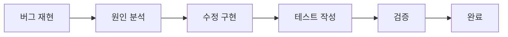
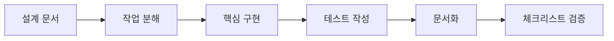

# Issue Handler Skill

Jira 스타일의 이슈를 자동으로 처리하는 Claude Code 스킬입니다.

## 🎯 기능

이슈 타입에 따라 적절한 워크플로우를 자동으로 실행합니다:

- **TASK**: 일반 작업 처리
- **BUG**: 버그 재현, 원인 분석, 수정, 테스트
- **FEATURE**: 설계, 구현, 테스트, 문서화
- **HOTFIX**: 긴급 분석 및 패치
- **IMPROVEMENT**: 코드 품질 개선 및 리팩토링
- **EPIC**: 대규모 작업 분해
- **STORY**: 사용자 스토리 구현
- **SUB-TASK**: 하위 작업 처리

## 📋 사용법

### 1. 기본 실행

```bash
# 이슈 코드로 직접 실행
/issue CMD-001

# 상세 정보와 함께 실행
/handle-issue BUG-123
```

### 2. Command Center에서 사용

```typescript
// Command Center에서 이슈 생성 시 자동 실행
const issue = {
  code: "BUG-456",
  data: {
    title: "로그인 시 500 에러 발생",
    description: "OAuth 로그인 시도 시 서버 에러 발생...",
    type: "BUG",
    priority: "HIGH",
    context_files: ["src/auth/oauth.ts", "src/auth/middleware.ts"]
  }
};

// Skill 실행
await executeSkill('issue-handler', issue);
```

### 3. 이슈 타입별 실행 플로우

#### BUG 처리 플로우


#### FEATURE 처리 플로우


## 🔧 설정

### skill.yaml 커스터마이징

```yaml
# .claude/skills/issue-handler/skill.yaml

# Claude 모델 설정
integrations:
  claude_code:
    model: "claude-3-opus"  # 또는 "claude-3-sonnet"
    max_tokens: 8000
    temperature: 0.3

# 테스트 설정
integrations:
  testing:
    coverage_threshold: 80  # 커버리지 임계값
    frameworks: ["jest", "pytest"]

# Git 설정
integrations:
  git:
    auto_branch: true
    branch_naming: "{type}/{issue_code}-{title_slug}"
```

## 📊 실행 결과

### 성공 응답 예시

```json
{
  "issue_id": "BUG-123",
  "status": "success",
  "actions_taken": [
    {
      "action": "reproduce_bug",
      "result": "completed",
      "timestamp": "2024-03-15T10:30:00Z",
      "details": "버그 재현 성공 - 3/3 케이스"
    },
    {
      "action": "find_root_cause",
      "result": "completed",
      "timestamp": "2024-03-15T10:35:00Z",
      "details": "원인: null 참조 오류 (line 45)"
    },
    {
      "action": "implement_fix",
      "result": "completed",
      "timestamp": "2024-03-15T10:40:00Z",
      "details": "null 체크 추가 및 기본값 처리"
    },
    {
      "action": "create_regression_test",
      "result": "completed",
      "timestamp": "2024-03-15T10:45:00Z",
      "details": "테스트 3개 추가"
    },
    {
      "action": "run_tests",
      "result": "completed",
      "timestamp": "2024-03-15T10:47:00Z",
      "details": "모든 테스트 통과 (커버리지: 87%)"
    }
  ],
  "artifacts": [
    "bug_fix.patch",
    "regression_test.spec.ts",
    "test_results.json"
  ],
  "next_steps": [
    "Code review",
    "Deploy to staging",
    "Verify in production"
  ],
  "metrics": {
    "execution_time": 1020000,
    "tokens_used": 4500,
    "files_modified": 3,
    "tests_run": 25,
    "coverage": 87
  }
}
```

## 🎨 커스터마이징

### 새로운 이슈 타입 추가

1. `types.ts`에 타입 추가:
```typescript
export enum IssueType {
  // ... 기존 타입
  RESEARCH = 'RESEARCH'  // 새 타입
}
```

2. `index.ts`에 핸들러 추가:
```typescript
class ResearchHandler extends IssueHandler {
  async execute() {
    // 리서치 워크플로우 구현
    await this.runAction('gather_information');
    await this.runAction('analyze_options');
    await this.runAction('create_report');
    // ...
  }
}

// 핸들러 등록
const IssueHandlers = {
  // ... 기존 핸들러
  RESEARCH: ResearchHandler
};
```

3. `skill.yaml`에 워크플로우 정의:
```yaml
workflows:
  RESEARCH:
    description: "기술 리서치 워크플로우"
    steps:
      - id: gather_info
        action: gather_information
      - id: analyze
        action: analyze_options
      - id: report
        action: create_report
```

## 🔄 워크플로우 규칙

### 자동 우선순위 조정
- HOTFIX 타입은 자동으로 CRITICAL 우선순위
- 'security' 라벨이 있으면 HIGH 우선순위

### 브랜치 전략
- 이슈 타입별 자동 브랜치 생성
- 명명 규칙: `{type}/{issue_code}-{title_slug}`
- 예: `bug/BUG-123-fix-login-error`

### 커밋 메시지 형식
```
[{issue_code}] {message}

- 상세 변경 사항
- 테스트 추가
- 문서 업데이트
```

## 📈 메트릭 수집

추적되는 메트릭:
- **execution_time**: 전체 실행 시간
- **tokens_used**: 사용된 토큰 수
- **files_modified**: 수정된 파일 수
- **tests_run**: 실행된 테스트 수
- **coverage**: 코드 커버리지
- **complexity_delta**: 복잡도 변화

## 🚨 에러 처리

### 재시도 정책
- 최대 3회 재시도
- 지수 백오프 (5s, 10s, 20s)

### 에러 타입별 처리
- **timeout**: 타임아웃 연장 후 재시도
- **insufficient_context**: 추가 정보 요청
- **test_failure**: 실패 분석 후 수정
- **merge_conflict**: 사용자 알림

## 🔗 통합

### Git 통합
- 자동 브랜치 생성
- 커밋 및 푸시
- PR 생성 (옵션)

### 알림 통합
- Slack 알림
- 이메일 알림
- Webhook 지원

### CI/CD 통합
- Jenkins 트리거
- GitHub Actions 실행
- GitLab CI 파이프라인

## 📚 참고 자료

- [Jira Issue Types](https://support.atlassian.com/jira-cloud-administration/docs/what-are-issue-types/)
- [Git Flow](https://nvie.com/posts/a-successful-git-branching-model/)
- [Semantic Versioning](https://semver.org/)

## 📄 라이선스

MIT License

## 🤝 기여

이슈와 PR은 언제나 환영입니다!

1. Fork the repository
2. Create your feature branch
3. Commit your changes
4. Push to the branch
5. Create a Pull Request